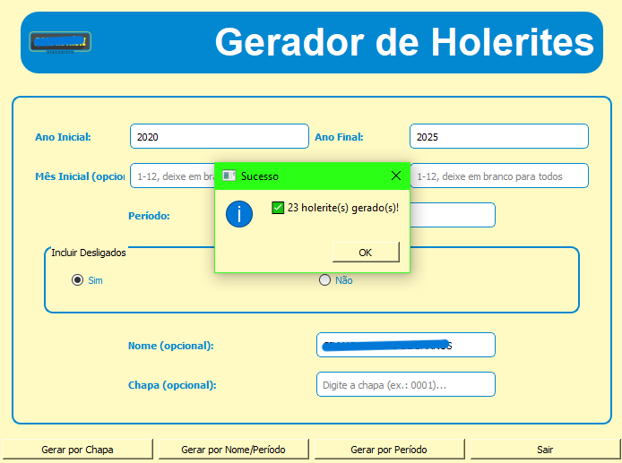
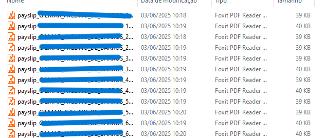

# 🧾 Gerador de Holerites — TOTVS RM + ReportLab


> Automação completa de folha de pagamento: extrai dados do **TOTVS RM (Oracle)**, calcula tributos com tabelas progressivas e gera holerites em PDF organizados por departamento.

---

## 🎯 O Problema que Resolve

Gerar centenas de holerites manualmente é lento, sujeito a erros e consome horas de RH. Esta ferramenta automatiza todo o processo: conecta ao banco Oracle do TOTVS RM, aplica as tabelas oficiais de INSS/IRRF/FGTS e entrega PDFs prontos organizados por setor.

---

## 🖥️ Demonstração

### Interface e geração em lote



### PDFs gerados e organizados automaticamente por funcionário



---

## ✨ Funcionalidades

- Extração automática de dados de funcionários ativos do TOTVS RM (Oracle)
- Cálculo progressivo de INSS, IRRF e FGTS conforme tabelas vigentes
- Geração de PDFs formatados por competência usando ReportLab
- Organização automática em pastas por departamento
- Modo de teste sem banco de dados (flag --mock)
- Credenciais via variáveis de ambiente, sem dados sensíveis no código

---

## 🛠️ Stack Tecnológica

| Tecnologia | Uso |
|---|---|
| **Python 3.10+** | Linguagem principal |
| **cx_Oracle** | Conexão ao banco Oracle (TOTVS RM) |
| **ReportLab** | Geração de PDFs formatados |
| **python-dotenv** | Gerenciamento seguro de variáveis de ambiente |
| **GitHub Actions** | CI/CD com testes automatizados |

---

## 📁 Estrutura do Projeto

```
Gerador-Holerite/
├── main.py                    # Ponto de entrada
├── database/
│   ├── conexao.py             # Conexão Oracle
│   └── mock_data.py           # Dados fictícios para testes
├── utils/
│   └── calculos.py            # Regras de INSS, IRRF e FGTS
├── pdf/
│   └── gerador_holerite.py    # Geração do PDF com ReportLab
├── tests/
│   └── __init__.py            # Testes automatizados
├── .env.example               # Modelo de configuração
└── requirements.txt
```

---

## 🚀 Como Rodar

```bash
# 1. Clone e instale
git clone https://github.com/DaudRaquel/Gerador-Holerite.git
cd Gerador-Holerite
pip install -r requirements.txt

# 2. Configure o ambiente
cp .env.example .env

# 3. Execute
python main.py --mock   # modo teste
python main.py          # modo produção
```

---

## 🔐 Segurança

Nenhuma credencial está hardcoded no código. Todas as conexões são configuradas via arquivo `.env` (não versionado). O repositório inclui apenas o `.env.example` com valores genéricos de exemplo.

---

## 👩‍💻 Sobre a Autora

Desenvolvido por **Raquel Daud** — desenvolvedora apaixonada por automação, dados e soluções que fazem diferença no dia a dia corporativo.

[](https://www.linkedin.com/in/raquel-daud-72a3991a2/)
